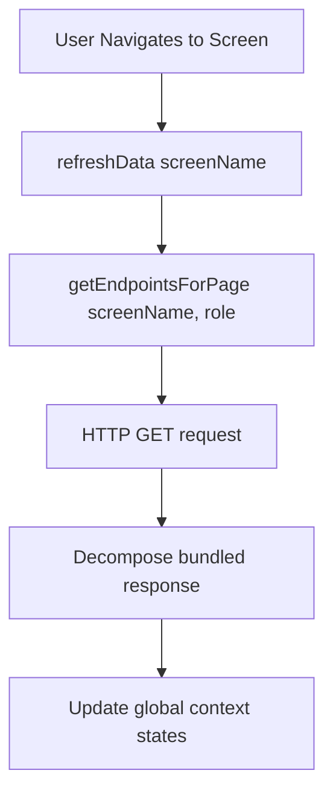

# Frontend Integration Guide

This document describes how the React Native mobile application integrates with the user-specific, role-based backend API. The central orchestrator is [AppContext.tsx](file:///C:/temporary%20projects/testing%20serverCompontnets%20apk/bajaj%20operations%20project/mobile-app/src/context/AppContext.tsx).

---

## 🔄 The Data Hydration Lifecycle (`refreshData`)

When a user navigates to a screen or pulls to refresh, the frontend triggers `refreshData(screenName)`. Rather than dispatching dozens of HTTP calls, the context determines the correct role-specific endpoint based on the user's role and page context.



---

## 🔀 Endpoint Scoping Map

The `getEndpointsForPage(page, role)` helper returns the exact lean endpoint path for the active user:

| Target Page | LC Endpoint | BM Endpoint | RM Endpoint |
| :--- | :--- | :--- | :--- |
| `dashboard` | `/lc/dashboard` | `/bm/dashboard` | `/rm/dashboard` |
| `attendance` | `/lc/attendance/calendar` | `/bm/attendance` | `/rm/attendance` |
| `tasks` | `/lc/tasks` | `/bm/tasks` | `/rm/tasks` |
| `approvals` / `finance` | *N/A (no page)* | `/bm/approvals` | `/rm/finance` |
| `users` | *N/A* | *N/A* | `/rm/users` |
| `analytics` | *N/A* | *N/A* | `/rm/analytics` |

---

## 📦 Bundled Response Decomposition

Dashboard and list endpoints return multi-entity payloads. The response parser in `AppContext` automatically unpacks them and updates the corresponding state variables:

### Example: LC Dashboard Decompression
When `/lc/dashboard` returns, the context unpacks it:
```typescript
if (endpoint === "/lc/dashboard") {
  // Payload: { branch, tasks, complaints, appliances, todayAttendance }
  const { branch, tasks, complaints, appliances, todayAttendance } = res.data;
  
  if (branch) setBranches([branch]);
  if (tasks) setScopedTasks(tasks);
  if (complaints) setComplaints(complaints);
  if (appliances) setAppliances(appliances);
  if (todayAttendance) {
    // Merge today's attendance log
    setAttendanceLog(prev => {
      const filtered = prev.filter(a => a.date !== todayAttendance.date);
      return [todayAttendance, ...filtered];
    });
  }
}
```

### Example: BM Dashboard Decompression
When `/bm/dashboard` returns:
```typescript
if (endpoint === "/bm/dashboard") {
  // Payload: { branches, approvals, visits, notifications }
  setBranches(res.data.branches || []);
  setApprovals(res.data.approvals || []);
  setVisits(res.data.visits || []);
  setNotifications(res.data.notifications || []);
}
```

---

## ⚡ Mutations and Actions Scoping

Actions are mapped to the correct endpoint path depending on user credentials.

### Example: Attendance Punch-in
When an LC marks attendance, the endpoint is dynamically scoped to `/lc/attendance`:
```typescript
const markAttendance = useCallback(async (weeklyTasks?: WeeklyTaskItem[]) => {
  try {
    const formattedTasks = weeklyTasks?.map(t => ({
      description: t.description,
      estimatedHours: t.estimatedHours
    }));

    // LC role queries /lc/attendance; others fall back to /attendance
    const url = currentUser?.role === RoleId.lc ? "/lc/attendance" : "/attendance";
    
    await apiCall(url, "POST", {
      checkIn: "09:00",
      weeklyTasks: formattedTasks
    });
    
    // Refresh the screen to rehydrate local states
    await refreshData("dashboard");
  } catch (error) {
    console.error("Failed to mark attendance", error);
  }
}, [currentUser]);
```
This ensures complete consistency between read APIs and write APIs.
